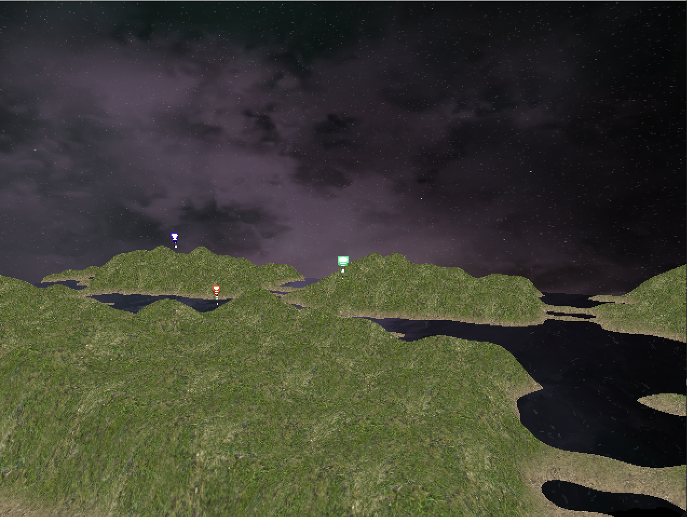

# Fireworks From Days Past ([YouTube Demo](https://youtu.be/0b3XA5249HE))

## Description

A real-time 3D computer graphics firework scene with firework particle simulator, first-person camera, procedural terrain, a skybox, and water implementation. This project was developed with 
the D language, SDL, and OpenGL.

## Screenshots
<table align="center">
  <tr>
    <td colspan="2" align="center">
      
    </td>
  </tr>
  <tr>
    <td></td>
    <td></td>
  </tr>
  <tr>
    <td></td>
    <td></td>
  </tr>
  <tr>
    <td></td>
    <td></td>
  </tr>
</table>

## How to Run

To run, ensure that you have D and OpenGL installed on your machine. Then, in `./project`, run the following terminal command:

```
dub
```
